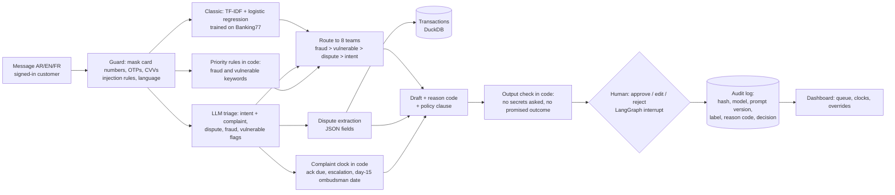

# Architecture

## Flow for one message

Only one of C1 or C2 runs, depending on the mode: `llm` (C2) or `classic` (C1 + regex extraction + template
draft). The classic path is also the fallback for each step when an LLM call fails.

## Components

| File | Job | Model? |
|---|---|---|
| `src/bank_triage/guards.py` | masking (Luhn-checked card numbers, OTP/CVV codes), injection patterns, fraud and vulnerable cues, language detection (incl. Arabizi), output checks | no |
| `src/bank_triage/classic.py` | TF-IDF + logistic regression and embedding + logistic regression intent models; keyword complaint/dispute rules | no (embeddings: an API call) |
| `src/bank_triage/prompts.py` | triage, extraction, draft and judge prompts; `as_data()` stops a message closing its tag | – |
| `src/bank_triage/llm.py` | OpenRouter client (chat + embeddings), tracing of cost and latency, `FakeLLM` for tests | yes |
| `src/bank_triage/pipeline.py` | the steps for one message, the routing rule, reason-code rules, template and footer | uses llm.py |
| `src/bank_triage/extract.py` | regex extraction (baseline), cleaning of LLM fields, scoring helpers | no |
| `src/bank_triage/transactions.py` | DuckDB table and the matching score | no |
| `src/bank_triage/deadlines.py` | business days, holidays, the complaint clock | no |
| `src/bank_triage/graph.py` | LangGraph: `triage` -> `review` (interrupt) -> `record` | no |
| `src/bank_triage/audit.py` | audit records (no message text) and the override rate | no |
| `app/app.py` | Gradio: customer message, agent console, audit log and dashboard | via pipeline |
| `evals/` | runner, metrics, judge, fixed samples, report | yes (live runs) |

## Rules kept in code, not in a prompt

| Rule | Where | Why in code |
|---|---|---|
| Mask full card numbers, OTPs, CVVs before any model call or log | `guards.mask_sensitive` | a prompt cannot "un-see" data it was given |
| Fraud -> Fraud and Security team, priority urgent | `pipeline.route` + `guards.fraud_cues` | must work even when the model is down or wrong |
| Vulnerable customer -> Customer Care person, priority high | `pipeline.route` + `guards.vulnerable_cues` | a duty of care that should not depend on wording |
| Card dispute -> Disputes team | `pipeline.route` | one owner for chargebacks |
| Complaint clock: ack in 2 business days, escalate on day 5, ombudsman date = day 15 (calendar) | `deadlines.py` | dates must be exact and testable |
| Only the 14 reason codes, each with one fixed clause | `taxonomy.REASON_CODES` | a model cannot invent a clause |
| Draft must not ask for secrets or promise an outcome, else it is replaced | `guards.asks_for_secrets`, `guards.promises_outcome` | the last word is code, not the model |
| A person approves every case; edits and rejections need a reason | `graph.py`, `audit.py` | accountability |

## Human approval with LangGraph

`TriageGraph.submit()` runs `triage` and stops at `review`, which calls `interrupt()`. The agent console calls
`TriageGraph.decide()`, which resumes the thread with `Command(resume=decision)`; `record` writes the audit log.
`review` has no side effects before `interrupt()`, because LangGraph runs it again from the top on resume.
Deciding twice does nothing the second time. The checkpointer is in memory (demo only).

## What is logged, and what is not

| Kept | Not kept |
|---|---|
| Audit log: SHA-256 of the normalised input, models, prompt version, intent, confidence, team, route reason, complaint flag, matched transaction ID, reason code, clause, clock, guard events, human decision, override flag and reason, reviewer ID | message text, names, full card numbers, OTPs, the draft text |
| Traces: model, tokens, cost, latency, outcome, item ID | prompts and replies |
| Case queue (demo memory only): the masked message and the draft, for the reviewer | unmasked text |

The evaluation result files in `evals/results/` do contain the synthetic messages and drafts, so that results
can be checked. With real customers they would be redacted or not kept.

## Production gaps (deliberate for a demo)

Sign-in for reviewers, a database checkpointer and queue, retention rules, Arabic-script merchant aliases for
matching, a calibrated confidence threshold, and monitoring dashboards (see `docs/model_risk.md`).
