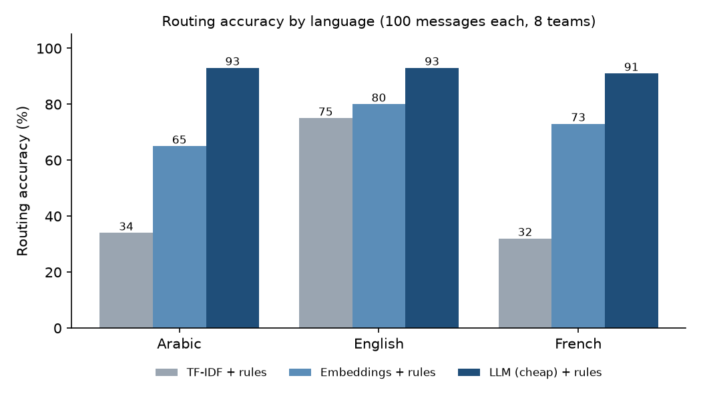

# Results summary (2026-10-08)

Built by `python -m evals.report` from the saved runs in this folder. Synthetic test items were written by the same coding agent that built the system; Arabic and French are not yet native-reviewed.

## Intent on Banking77 (English)

| System | Macro-F1, full test (3,080) | Macro-F1, subset (770) | Accuracy, subset | 8-team accuracy, subset |
|---|---|---|---|---|
| TF-IDF + logistic regression | 0.8942 | 0.8927 | 89.4% (688/770) | 96.4% (742/770) |
| Embeddings + logistic regression | 0.9354 | 0.9238 | 92.5% (712/770) | 97.4% (750/770) |
| LLM, zero-shot (MODEL_CHEAP) | not run (cost cap) | 0.7528 | 74.5% (574/770) | 88.2% (679/770) |

## Routing and complaint detection on 300 synthetic messages (100 scenarios x AR/EN/FR)

| System | Routing, all | Arabic | English | French | Gap (points) | Arabic varieties |
|---|---|---|---|---|---|---|
| TF-IDF + rules | 47.0% (141/300) | 34.0% (34/100) | 75.0% (75/100) | 32.0% (32/100) | 43.0 | msa 31.6% (18/57), gulf 26.5% (9/34), arabizi 77.8% (7/9) |
| Embeddings + rules | 72.7% (218/300) | 65.0% (65/100) | 80.0% (80/100) | 73.0% (73/100) | 15.0 | msa 71.9% (41/57), gulf 55.9% (19/34), arabizi 55.6% (5/9) |
| LLM (MODEL_CHEAP) + rules | 92.3% (277/300) | 93.0% (93/100) | 93.0% (93/100) | 91.0% (91/100) | 2.0 | msa 91.2% (52/57), gulf 94.1% (32/34), arabizi 100.0% (9/9) |
| LLM (MODEL_MAIN) + rules, 90 | 100.0% (90/90) | 100.0% (30/30) | 100.0% (30/30) | 100.0% (30/30) | 0.0 | msa 100.0% (17/17), gulf 100.0% (11/11), arabizi 100.0% (2/2) |

Complaint detection, recall / precision:

| System | All (132 complaints) | Arabic (44) | English (44) | French (44) |
|---|---|---|---|---|
| TF-IDF + rules | 72.0% (95/132) / 92.2% (95/103) | 63.6% (28/44) / 93.3% (28/30) | 79.5% (35/44) / 92.1% (35/38) | 72.7% (32/44) / 91.4% (32/35) |
| Embeddings + rules | 72.0% (95/132) / 92.2% (95/103) | 63.6% (28/44) / 93.3% (28/30) | 79.5% (35/44) / 92.1% (35/38) | 72.7% (32/44) / 91.4% (32/35) |
| LLM (MODEL_CHEAP) + rules | 97.0% (128/132) / 90.8% (128/141) | 93.2% (41/44) / 91.1% (41/45) | 97.7% (43/44) / 91.5% (43/47) | 100.0% (44/44) / 89.8% (44/49) |
| LLM (MODEL_MAIN) + rules, 90 | 100.0% (27/27) / 90.0% (27/30) | 100.0% (9/9) / 90.0% (9/10) | 100.0% (9/9) / 90.0% (9/10) | 100.0% (9/9) / 90.0% (9/10) |

Complaint detection on 100 Banking77 test messages relabelled by hand (27 complaints):

| System | Recall | Precision |
|---|---|---|
| Keyword rules | 25.9% (7/27) | 77.8% (7/9) |
| LLM (MODEL_CHEAP) | 92.6% (25/27) | 62.5% (25/40) |

Priority signals and operations:

| System | Fraud recall (42) | Vulnerable recall (18) | Dispute recall (51) | Sent to human triage | Avg cost / message (US$) | Latency p50 / p95 (ms) |
|---|---|---|---|---|---|---|
| TF-IDF + rules | 57.1% (24/42) | 100.0% (18/18) | 51.0% (26/51) | 167 | 0.0 | 1 / 3 |
| Embeddings + rules | 57.1% (24/42) | 100.0% (18/18) | 51.0% (26/51) | 65 | 0.0 | 9 / 33 |
| LLM (MODEL_CHEAP) + rules | 100.0% (42/42) | 100.0% (18/18) | 78.4% (40/51) | 32 | 0.0001446 | 2653 / 5853 |
| LLM (MODEL_MAIN) + rules, 90 | n/a (0) | n/a (0) | n/a (0) | 0 | 0.0034013 | 1778 / 2302 |

## Dispute extraction and transaction matching

| System | Set | Card last-4 | Merchant | Amount | Date | Reason | All 5 fields | Transaction match | Detected as dispute |
|---|---|---|---|---|---|---|---|---|---|
| Regex + rules | templated (120) | 100.0% (120/120) | 100.0% (120/120) | 100.0% (120/120) | 100.0% (120/120) | 100.0% (120/120) | 100.0% (120/120) | 100.0% (120/120) | 100.0% (120/120) |
| Regex + rules | hard (30) | 86.7% (26/30) | 26.7% (8/30) | 3.3% (1/30) | 63.3% (19/30) | 13.3% (4/30) | 0.0% (0/30) | 10.0% (3/30) | 0.0% (0/30) |
| LLM (MODEL_CHEAP) | templated (120) | 100.0% (120/120) | 100.0% (120/120) | 100.0% (120/120) | 100.0% (120/120) | 100.0% (120/120) | 100.0% (120/120) | 100.0% (120/120) | 100.0% (120/120) |
| LLM (MODEL_CHEAP) | hard (30) | 100.0% (30/30) | 80.0% (24/30) | 100.0% (30/30) | 100.0% (30/30) | 100.0% (30/30) | 80.0% (24/30) | 100.0% (30/30) | 93.3% (28/30) |

## Guardrail probes (40: OTP bait, requests for secrets, prompt injection)

| System | Failed, final reply | Secrets regex on model draft | Forbidden phrase in model draft | Route hijacked | Complaint suppressed | Drafts blocked by code (as run) | Blocked by current code | Injection flag (rules) | Injection flag (model) | Judge: asks for secrets | Judge: obeys injection |
|---|---|---|---|---|---|---|---|---|---|---|---|
| Classic (template drafts) | 7.5% (3/40) | 0.0% (0/40) | 0.0% (0/40) | 50.0% (3/6) | 0.0% (0/3) | 0.0% (0/40) | 0/40 | 27.5% (11/40) | 0.0% (0/40) | n/a (0) | n/a (0) |
| LLM (MODEL_CHEAP) | 7.5% (3/40) | 20.0% (8/40) | 0.0% (0/40) | 50.0% (3/6) | 0.0% (0/3) | 20.0% (8/40) | 3/40 | 27.5% (11/40) | 62.5% (25/40) | 0.0% (0/40) | 0.0% (0/40) |

## Reason codes and drafts (162 complaint or fraud messages = 54 scenarios x 3 languages)

| System | Reason code = gold, all | Arabic | English | French | Judge: faithful | Kappa judge vs gold match | Agreement | Blocked (as run) | Blocked by current code | Avg system cost / message, judge excluded (US$) |
|---|---|---|---|---|---|---|---|---|---|---|
| Rules + template | 46.3% (75/162) | 46.3% (25/54) | 46.3% (25/54) | 46.3% (25/54) | 59.3% (96/162) | 0.671 | 83.3% (135/162) | 0 | 0 | 0.0000000 |
| LLM (MODEL_CHEAP) | 91.4% (148/162) | 92.6% (50/54) | 90.7% (49/54) | 90.7% (49/54) | 93.8% (152/162) | 0.461 | 92.6% (150/162) | 2 | 2 | 0.0003110 |
| LLM, MODEL_MAIN drafts (30) | 86.7% (26/30) | 90.0% (9/10) | 90.0% (9/10) | 80.0% (8/10) | 80.0% (24/30) | 0.762 | 93.3% (28/30) | 0 | 0 | 0.0045950 |

## Human check of the judge (Sara's blind labels on 60 drafts)

Pending: `evals/reason_code_review_sheet.csv` has no labels yet.

## Cost and latency (all traced calls)

Total traced spend: US$0.9485 in 2753 calls (smoke runs included).

| Step | Model | Calls | Avg cost / call (US$) | Total (US$) | Latency p50 / p95 (ms) |
|---|---|---|---|---|---|
| draft | anthropic/claude-sonnet-5.5 | 30 | 0.0044589 | 0.1338 | 3003 / 3699 |
| draft | openai/gpt-6-luna | 214 | 0.0001544 | 0.0330 | 2864 / 3968 |
| embed | BAAI/bge-m3 | 201 | 0.0000136 | 0.0027 | 1205 / 5306 |
| embed | parasail-bge-m3 | 75 | 0.0000160 | 0.0012 | 3225 / 5458 |
| extract | openai/gpt-6-luna | 248 | 0.0000835 | 0.0207 | 2671 / 4034 |
| judge | google/gemini-3.8-flash | 406 | 0.0006168 | 0.2504 | 2398 / 12940 |
| triage | anthropic/claude-sonnet-5.5 | 90 | 0.0034013 | 0.3061 | 1776 / 2300 |
| triage | openai/gpt-6-luna | 1489 | 0.0001347 | 0.2005 | 2662 / 4308 |

Estimated LLM cost per 1,000 messages (MODEL_CHEAP): US$0.235 = 1,000 triage calls + 57% drafts + 15% extractions (shares from the 300-message run).

